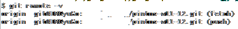

# Git remote로 한번에 2개 레포에 같은 내용 push하기

1. 기존 remote 설정

- fetch와 push가 한개씩 존재

2. push를 2개로 설정
```
git remote set-url --add --push origin <repo-url1>
git remote set-url --add --push origin <repo-url2>
```