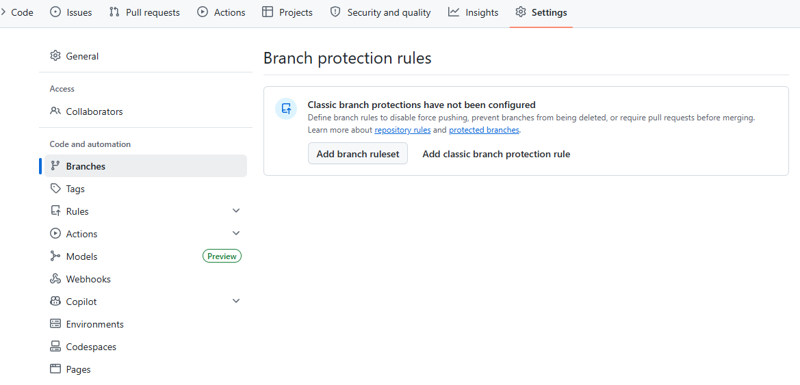
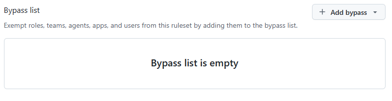
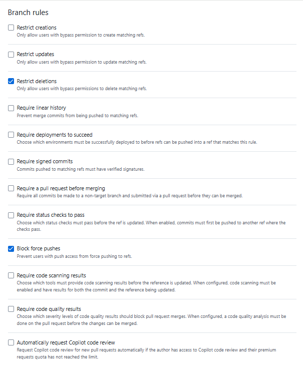
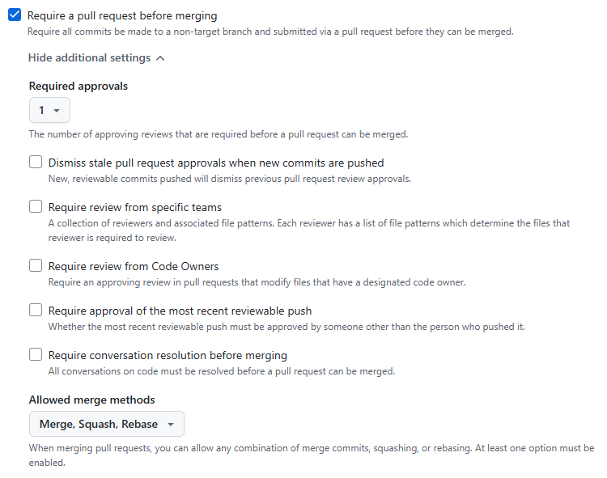

```
Settings
→ Branches
→ Add branch ruleset / Add branch protection rule
```


```
bypass list
→ 브랜치 보호 규칙을 무시할 수 있는 사람
→ Branch Protection Rule을 걸어 놔도
특정 사람만 예외 처리 가능

ex.
main 브랜치는 pr 승인 2명 필요
bypassList에 나를 넣으면 승인 없이도 merge 가능
```


```
main, dev 같은 보호 브랜치에 대해
"어떤 작업을 허용/금지할 것인가?"를 정하는 기능

1. Restrict creations
- 해당 브랜치 생성 제한

2. Restrict updates
- 브랜치 수정 자체 제한

3. Restrict deletions
- 브랜치 삭제 금지

4. Require linear history
- Merge Commit 금지
- 커밋 히스토리를 일자로 유지
(rebase commit, squash merge)

5. Require depolyment to succeed
- 배포 성공해야 merge 허용
- staging deploy 성공
- protection deploy 성공

6. Require signed commits
- GPG 서명된 commit 허용
- "이 커밋 진짜 작성자가 맞는가?"

7. Require a pull request before merging
- 직접 push 금지
- PR로만 merge 가능

8. Require status checks to pass
- 테스트 성공해야 merge 가능

9. Block force pushes
- git push --force 금지

10. Require code scanning results
- 보안 취약점 검사 통과 필요

11. Require code quality results
- 코드 품질 검사 통과 필요

12. Automatically request Copilot code review
- PR 생성 시 Copilot 리뷰 자동 요청
```

| 옵션                        | 핵심 의미           |
| ------------------------- | --------------- |
| Restrict creations        | 브랜치 생성 제한       |
| Restrict updates          | 브랜치 수정 금지       |
| Restrict deletions        | 브랜치 삭제 금지       |
| Require linear history    | merge commit 금지 |
| Require deployments       | 배포 성공 필수        |
| Require signed commits    | GPG 서명 필수       |
| Require PR before merging | 직접 push 금지      |
| Require status checks     | 테스트 성공 필수       |
| Block force pushes        | force push 금지   |
| Require code scanning     | 보안 검사 필수        |
| Require code quality      | 품질 검사 필수        |


```
Require a pull request before merging

PR Merge를 어떤 규칙으로 강제할 것인가?

1. Required approvals
- PR merge 전 필요한 승인 개수

2. Dismiss stale pull request approvals when new commits are pushed
- 새 커밋 push되면 기존 approve 무효화
- 새 커밋 올라오면 다시 리뷰

3. Require review from specific teams
- 특정 팀 리뷰 강제

4. Require review from Code Owners
- 특정 파일 담당자 승인 필수

5. Require approval of the most recent reviewable push
- 마지막 push는 다른 사람이 승인

6. Require conversation resolution before merging
- 리뷰 댓글 unresolved 상태면 merge 금지
- 리뷰어가 댓글을 남겼는데 작성자가 수정 안하고 merge 하려 하면 merge 불가

7. Allowed merge methods
- 허용할 merge 방식
    - merge : Merge branch 'feature/login' 커밋 생김
        - 장점 : 브랜치 기록 보존
        - 단점 : 히스토리 복잡
    - squash : pr 커밋 여러 개를 1개 commit으로 압축
        - fix1, fix2, fix3
        - feature/login completed 1개만 남음
        - 장점 : 히스토리 깔끔
        - 단점 : 세부 commit 사라짐
    - rebase : merge commit없이 커밋을 직선으로 이어 붙임
        - 장점 : 깔끔한 linear history
        - 단점 : 이해 어려움, commit hash 변경
```